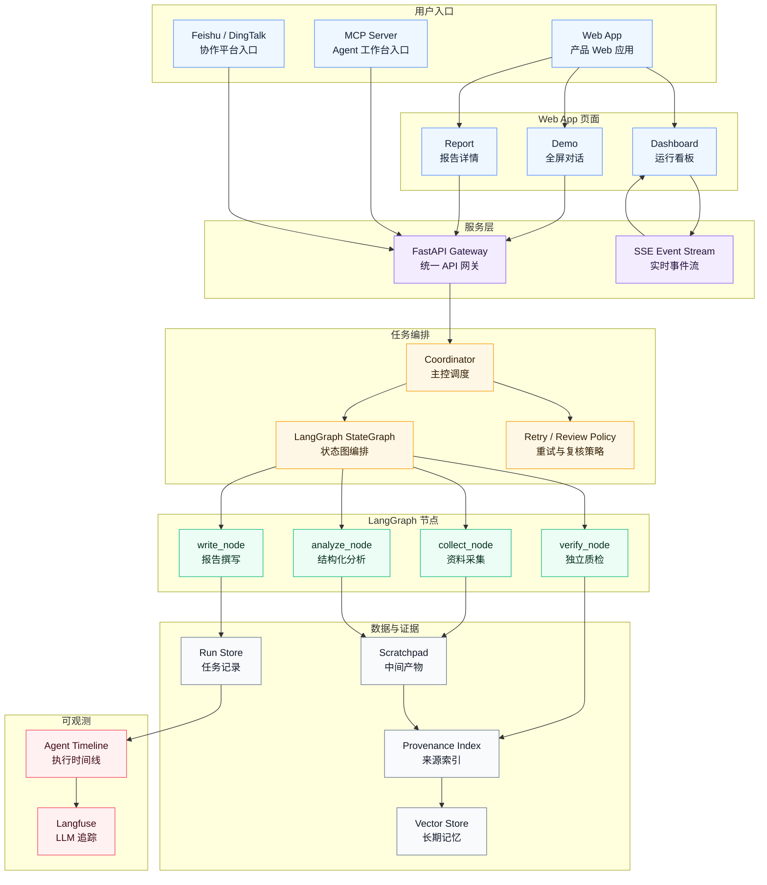

# CompEye Agent — AI 竞品分析 Agent 协作系统

> 基于 LangGraph 状态图的竞品分析 Agent 系统，自动完成信息采集 → 分析 → 报告生成，每条结论可溯源。

[](https://www.python.org/)
[](LICENSE)

---

## 产品介绍

CompEye Agent 是面向产品、市场、战略和研发团队的竞品分析工作台。系统将公开资料采集、结构化分析、报告撰写和独立质检拆分为多个专职节点，通过 LangGraph 状态图编排和证据模型，完成从需求输入到可信报告交付的完整流程。

与传统"人工搜索 + 手工整理"的竞品调研方式不同，CompEye Agent 强调三点：

- **分析过程自动化**：把目标产品、竞品、分析维度和重点指标转化为可执行的状态图流程。
- **结论可追溯**：报告中的关键判断需要关联来源 URL、原文片段和 provenance 索引。
- **执行过程可观测**：每个节点的状态、产物、质检结果和重写动作可以被追踪、复盘和治理。

产品最终形态不是单一网页工具，而是一个可通过 Web App、MCP Server、飞书/钉钉等协作平台入口调用的竞品分析基础能力。

---

## 🏗️ 最终目标架构



架构按六个部分组织：用户入口包括 Web App、MCP Server 和协作平台；Web App 内部包含全屏对话、运行看板和报告详情页面；服务层提供 API 与实时事件流；任务编排层使用 LangGraph StateGraph 编排四个专职节点（collect/analyze/write/verify），带自动重写闭环；数据层保存中间产物、运行记录、来源索引和长期记忆；可观测层使用自托管 Langfuse 追踪所有 LLM 调用。

## 🚀 在线体验

👉 **在线 Demo：** [http://101.37.148.215](http://101.37.148.215)

当前网页端已经提供产品化输入，不需要手写 JSON：

- 输入目标产品和竞品名称
- 勾选分析维度，填写重点指标
- 点击示例按钮一键填充演示案例
- 点击开始分析后，可看到 Collector / Analyzer / Writer / Verifier 的阶段进度
- 任务完成后可查看完整 Markdown 报告、Verifier JSON、来源索引

产品入口已升级为以 FastAPI 同服务托管的 React Web App 为主：

- **Web App**：产品 Web 应用，承载产品介绍、全屏对话、Dashboard 和报告详情。
- **MCP Server**：面向 Claude Code、Codex 等 Agent 工作台暴露竞品分析工具能力。
- **协作平台入口**：接入飞书、钉钉等企业协作平台，用于发起任务、接收报告和处理复核通知。
- **服务层 API**：FastAPI 提供任务创建、结果查询、SSE 事件流和报告/证据产物接口。
- **云端可访问部署**：用户可直接打开网页体验，无需本地运行。

---

## 工程设计原则

系统不是把多个 Agent 串联起来生成一份报告，而是把竞品分析抽象为可编排、可追踪、可校验的状态图工作流。设计上参考了 LangGraph 的状态管理、Claude Code 的主循环思路，并将其转化到竞品分析场景中：

| 工程原则 | 本系统如何落地 |
|----------------|---------------|
| **StateGraph + 条件路由** | LangGraph 编排 collect→analyze→write→verify 四节点，质检失败时自动触发一次 rewrite，形成最小闭环 |
| **Scratchpad 共享存储** | SQLite-backed Scratchpad，每个节点读取上游产物、写入自己的输出，避免上下文爆炸 |
| **独立 Verification 节点** | 质检节点使用专用模型，**不继承撰写者历史**，独立判断，防确认偏误 |
| **规则层溯源校验** | `services/verification.py` 会检查最终报告是否包含来源标注 / URL / provenance，缺失则判失败 |
| **Async Generator 流式透出** | EventBus 内存队列将 Coordinator 事件直推 SSE 端点，零轮询、毫秒级延迟 |
| **自托管 Langfuse 追踪** | litellm 原生 Langfuse 回调，捕获所有 LLM 调用（提示词/输出/tokens/延迟），数据不出网 |

核心目标是让每个节点职责单一、输入输出结构清晰，并且让系统能够解释"为什么得出这个结论、由谁生成、依据来自哪里、是否经过质检"。

---

## 🏛️ 系统架构

```text
用户入口（Web App / CLI / API）
      │
      ▼
FastAPI Gateway ──→ EventBus ──→ SSE 实时推送
      │
      ▼
Coordinator DAG 调度器
      │
      ▼
LangGraph StateGraph（graph/build.py）
      │
      ├── collect_node ──→ litellm + web_search
      │       ↓ state: collect_raw
      ├── analyze_node
      │       ↓ state: analyze_findings
      ├── write_node
      │       ↓ state: report
      ├── verify_node
      │       ↓ state: verifier_result, passed
      └── should_rewrite? ──→ 如果 passed=False 且 retry_count<1
              ↓ 返回 write_node（最多重写一次）
              ↓
      Provenance Guard + 质检结果
              ↓
      Markdown 报告 + 来源索引 + Verifier JSON
              ↓
      持久化 Artifacts（SQLite）
              ↓
      SSE 推送 run.completed 事件
```

### 执行流程（LangGraph 编排）

1. **collect_node**：调用 litellm 生成搜索查询，web_search 工具返回原始资料，写入 `state["collect_raw"]`（JSON格式）
2. **analyze_node**：读取 `collect_raw`，调用 litellm 结构化分析，写入 `state["analyze_findings"]`
3. **write_node**：读取 `analyze_findings`，生成带 provenance 的 Markdown 报告，写入 `state["report"]`
4. **verify_node**：独立读取 `report`，调用质检模型判断溯源完整性，写入 `state["verifier_result"]` 和 `state["passed"]`
5. **条件路由**：如果 `passed=False` 且 `retry_count<1`，回到 write_node 重写一次；否则终止

所有节点共享同一个 `AnalysisState` 字典（TypedDict），状态持久化到 LangGraph 的 SQLite checkpointer，支持断点续跑。

---

## 🚢 快速开始

### 本地运行（CLI）

```bash
# 1. 安装依赖
pip install -r requirements.txt

# 2. 配置环境变量
cp .env.example .env
# 编辑 .env，填入 MIMO_API_KEY

# 3. 运行 CLI
python main.py <<EOF
{
  "productName": "飞书",
  "competitors": ["钉钉"],
  "dimensions": [{"name": "定价", "indicators": ["免费套餐"]}],
  "analysisType": "SWOT"
}
EOF
```

### 启动 API 服务

```bash
# 开发模式（带热重载）
uvicorn api_app:app --reload --host 0.0.0.0 --port 8000

# 生产模式
uvicorn api_app:app --host 0.0.0.0 --port 8000 --workers 2
```

API 文档：`http://localhost:8000/docs`

核心端点：
- `POST /api/runs` — 创建分析任务
- `GET /api/runs/:id` — 查询任务状态
- `GET /sse/runs/:id` — SSE 事件流（实时进度）
- `GET /api/runs/:id/artifacts` — 获取报告/质检结果

### 测试

```bash
pytest
```

当前套件 140 个测试，覆盖：
- LLM 客户端封装 + 弹性重试
- LangGraph 节点逻辑（mocked LLM）
- Coordinator 编排 + 事件双写
- 前端契约（SSE 事件名、DAG 状态、artifacts）
- VectorStore 语义检索（sentence-transformers）
- Langfuse 客户端（litellm callback）

---

## 📁 项目结构

```
CompEyeAgent/
├── main.py                      # CLI 入口
├── api_app.py                   # FastAPI 生产入口（API + SSE + 前端托管）
├── runner.py                    # 分析运行器（调用 LangGraph）
├── graph/
│   ├── build.py                 # LangGraph StateGraph 构建
│   ├── state.py                 # AnalysisState TypedDict
│   ├── nodes.py                 # 四个节点函数（collect/analyze/write/verify）
│   └── prompts.py               # 提示词模板
├── models/
│   ├── schema.py                # 竞品输入 + Run/Event/Artifact 知识 Schema
│   ├── coordinator.py           # DAG / Scratchpad / NodeExecutionResult 模型
│   ├── source_layer.py          # SourceSeed / EvidenceItem / Connector 模型
│   └── provenance.py            # 溯源对象
├── services/
│   ├── run_service.py           # Run 生命周期管理
│   ├── coordinator_loop.py      # DAG 调度器主循环 + 事件双写
│   ├── coordinator_foundation.py # DAG / Scratchpad 状态管理
│   ├── graph_node_executor.py   # LangGraph 节点 → Coordinator DAG 适配器
│   ├── verification.py          # Provenance guard + Verifier 解析
│   ├── event_bus.py             # Asyncio 内存事件队列
│   ├── llm_telemetry.py         # litellm token 回调（Cost 页面数据源）
│   ├── langfuse_client.py       # Langfuse 自托管集成
│   ├── llm_client.py            # litellm 封装 + 弹性重试
│   ├── web_search.py            # 网络搜索工具（Jina Reader）
│   ├── evidence_service.py      # 证据索引与提示词注入
│   ├── evidence_extractor.py    # 关键词证据提取
│   ├── source_connectors.py     # 5 种来源 Connector
│   ├── source_indexer.py        # 报告 URL 提取
│   └── source_refresh.py        # 来源刷新调度
├── storage/
│   ├── run_store.py             # SQLite Run / Event / Artifact 存储
│   ├── coordinator_store.py     # SQLite DAG / Scratchpad 存储
│   ├── source_store.py          # SQLite 来源 / 证据存储
│   └── vector_store.py          # ChromaDB + bge-base-zh-v1.5 长期记忆
├── config/
│   ├── settings.py              # LLM 工厂函数 + 环境变量
│   ├── model_registry.py        # 模型配置 + 弹性策略
│   └── source_seeds.py          # 默认来源种子注册表
├── scripts/
│   └── index_sources.py         # 来源索引 CLI
├── frontend/                    # React 19 + TypeScript + Vite
│   └── src/
│       ├── pages/               # Demo / Dashboard / Report 三个页面
│       ├── api/client.ts        # Typed API 客户端 + SSE EventSource
│       └── api/types.ts         # TypeScript 类型定义（镜像 Pydantic）
├── tests/                       # pytest 测试套件（140 个测试）
├── docs/                        # 设计文档和阶段计划
├── requirements.txt
└── README.md
```

---

## 📖 设计文档

完整的架构设计、12 项优化详细说明、分阶段路线图见 [docs/DESIGN.md](docs/DESIGN.md)。

Phase 1.5 在线产品 Demo 的详细执行计划见 [docs/DESIGN.md](docs/DESIGN.md) 第 5-6 节。

Phase 2 各子里程碑的设计文档见上方 Phase 2 详细里程碑中的文档索引。

云端部署环境变量、构建命令、启动命令和持久化目录说明见 [docs/DEPLOYMENT.md](docs/DEPLOYMENT.md)。

### React Web App 本地启动

```bash
cd frontend
npm install
npm run dev
```

开发服务器默认监听 `http://localhost:5173`，并把 `/api/*` 与 `/sse/*` 代理到本地 FastAPI `http://127.0.0.1:8000`。

当前 React Web App 已接入 Phase 1.5 API：`/demo` 可创建真实 run，`/dashboard/:runId` 订阅 SSE 事件流，`/reports/:runId` 加载报告产物和来源索引。

生产构建：

```bash
cd frontend
npm run build
```

同服务启动：

```bash
cd ..
uvicorn api_app:app --host 0.0.0.0 --port 8000
```

构建后，FastAPI 会直接托管 `frontend/dist`。`/api/*` 和 `/sse/*` 保持后端接口，`/demo`、`/dashboard/:runId`、`/reports/:runId` 等 React 路由刷新会回退到 `index.html`。

### MCP Server（Claude Code / Agent 工作台接入）

```bash
# stdio 模式（Claude Desktop / Claude Code 直接调用）
python mcp_server.py

# HTTP/SSE 模式（远程访问）
python mcp_server.py --transport http --port 9000
```

Claude Desktop 配置（`claude_desktop_config.json`）：

```json
{
  "mcpServers": {
    "compeye": {
      "command": "python",
      "args": ["mcp_server.py"],
      "env": {
        "MIMO_BASE_URL": "https://api.xiaomimimo.com/v1",
        "MIMO_API_KEY": "sk-xxx"
      }
    }
  }
}
```

暴露的 MCP 工具：`create_run`、`get_run`、`get_report`、`get_verification`、`list_runs`、`get_sources`、`get_scratchpad`、`cancel_run`。

---

## 🛠️ 环境变量

```bash
# MiMo API（OpenAI 兼容）
MIMO_BASE_URL=https://api.xiaomimimo.com/v1
MIMO_API_KEY=your_api_key_here

# 持久化存储（云端请指向持久化磁盘）
RUN_STORE_PATH=data/run_store.sqlite3
COORDINATOR_STORE_PATH=data/coordinator_store.sqlite3
SOURCE_STORE_PATH=data/source_store.sqlite3
COMPETEYE_CHECKPOINT_PATH=data/graph_checkpoints.sqlite3
COMPETEYE_VECTOR_STORE_PATH=data/vector_store

# 模型分配（可选，默认如下）
COLLECTOR_MODEL=mimo-v2.5
ANALYZER_MODEL=mimo-v2.5
WRITER_MODEL=mimo-v2.5
VERIFIER_MODEL=mimo-v2.5-pro

# 长期记忆 embedding（本地 sentence-transformers 模型，免费、数据不出网）
# 默认 BAAI/bge-base-zh-v1.5（768 维）；低内存可用 BAAI/bge-small-zh-v1.5
COMPETEYE_EMBEDDING_MODEL=BAAI/bge-base-zh-v1.5

# 可观测（Langfuse 自托管，唯一观测组件；不配置则关闭，应用照常运行）
# 指向自托管 Langfuse 实例（阿里云内网），数据不出网
LANGFUSE_HOST=http://your-langfuse-host:3000
LANGFUSE_PUBLIC_KEY=pk-lf-...
LANGFUSE_SECRET_KEY=sk-lf-...
```

完整部署说明见 [docs/DEPLOYMENT.md](docs/DEPLOYMENT.md)。云端必须把 `*_STORE_PATH` 放到持久化目录，例如 `/data/*.sqlite3`。

### Langfuse 可观测

系统使用自托管 Langfuse 作为唯一的 LLM 可观测组件，捕获所有 litellm 调用的：
- 提示词（系统提示 + 用户消息）
- 输出文本
- token 使用量（输入/输出）
- 延迟和错误率

**数据隐私**：Langfuse 实例部署在阿里云内网，所有 LLM 追踪数据不出网。如未配置 `LANGFUSE_*` 环境变量，追踪功能自动关闭，系统正常运行。

---

## 📜 许可证

MIT License — 欢迎开源共建！
