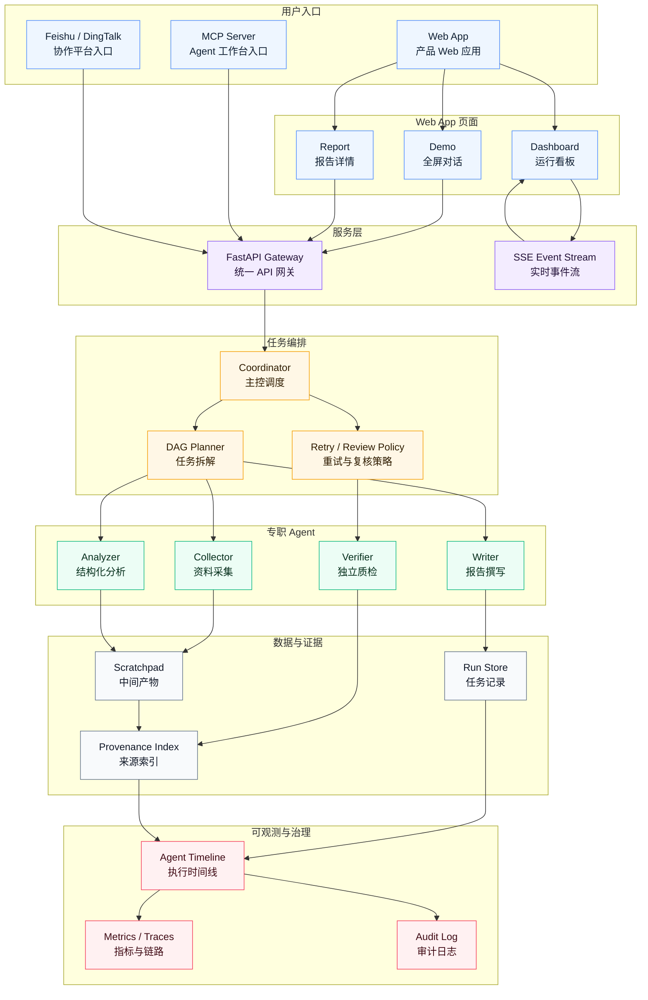

# CompEye Agent — AI 竞品分析 Agent 协作系统

> 多 Agent 协同，自动完成竞品信息采集 → 分析 → 报告生成，每条结论可溯源。

[](https://www.python.org/)
[](LICENSE)

---

## 产品介绍

CompEye Agent 是面向产品、市场、战略和研发团队的竞品分析工作台。系统将公开资料采集、结构化分析、报告撰写和独立质检拆分为多个专职 Agent，通过统一的任务编排和证据模型，完成从需求输入到可信报告交付的完整流程。

与传统“人工搜索 + 手工整理”的竞品调研方式不同，CompEye Agent 强调三点：

- **分析过程自动化**：把目标产品、竞品、分析维度和重点指标转化为可执行任务链路。
- **结论可追溯**：报告中的关键判断需要关联来源 URL、原文片段和 provenance 索引。
- **执行过程可观测**：每个 Agent 的状态、产物、质检结果和重试动作可以被追踪、复盘和治理。

产品最终形态不是单一网页工具，而是一个可通过 Web App、MCP Server、飞书/钉钉等协作平台入口调用的竞品分析基础能力。

---

## 🏗️ 最终目标架构



架构按七个部分组织：用户入口包括 Web App、MCP Server 和协作平台；Web App 内部包含全屏对话、运行看板和报告详情页面；服务层提供 API 与实时事件流；任务编排层拆解 DAG、调度 Agent、处理重试与复核；专职 Agent 分别完成采集、分析、撰写和质检；数据层保存中间产物、运行记录和来源索引；可观测层沉淀时间线、指标和审计日志。

## 🚀 在线体验

👉 **在线 Demo：** [https://compeyeagent.streamlit.app/](https://compeyeagent.streamlit.app/)

当前网页端已经提供产品化输入，不需要手写 JSON：

- 输入目标产品和竞品名称
- 勾选分析维度，填写重点指标
- 点击示例按钮一键填充演示案例
- 点击开始分析后，可看到 Collector / Analyzer / Writer / Verifier 的阶段进度
- 默认启用快速演示模式，只跑一次完整质检以缩短等待时间；关闭后会启用“失败自动重写一次”的严格复检链路

后续产品入口会从 Streamlit MVP 升级为：

- **Web App**：产品 Web 应用，承载产品介绍、全屏对话、Dashboard 和报告详情。
- **MCP Server**：面向 Claude Code、Codex 等 Agent 工作台暴露竞品分析工具能力。
- **协作平台入口**：接入飞书、钉钉等企业协作平台，用于发起任务、接收报告和处理复核通知。
- **服务层 API**：FastAPI 提供任务创建、结果查询、SSE 事件流和报告/证据产物接口。
- **云端可访问部署**：用户可直接打开网页体验，无需本地运行。

---

## 工程设计原则

系统不是把多个 Agent 串联起来生成一份报告，而是把竞品分析抽象为可编排、可追踪、可校验的工作流。设计上参考了 Claude Code 在主循环、工具调用、上下文管理和可观测性上的工程思路，并将其转化到竞品分析场景中：

| 工程原则 | 本系统如何落地 |
|----------------|---------------|
| **主循环 + 工具调用** | Coordinator 主循环通过 DAG 状态机动态调度四类节点执行器，每个节点独立运行 CrewAI Crew |
| **Scratchpad 共享目录** | SQLite-backed Scratchpad，每个节点读取上游产物、写入自己的输出，避免上下文爆炸 |
| **独立 Verification Agent** | 质检 Agent 使用 MiMo-V2.5-Pro，**不继承撰写者历史**，独立判断，防确认偏误 |
| **规则层溯源校验** | `services/verification.py` 会检查最终报告是否包含来源标注 / URL / provenance，缺失则判失败 |
| **Async Generator 流式透出** | EventBus 内存队列将 Coordinator 事件直推 SSE 端点，零轮询、毫秒级延迟 |
| **分层可观测性** | Prometheus `/metrics` 端点（始终可用）+ OTel 分布式追踪与指标（按需启用） |

核心目标是让每个 Agent 职责单一、输入输出结构清晰，并且让系统能够解释“为什么得出这个结论、由谁生成、依据来自哪里、是否经过质检”。

---

## ✅ Phase 1 核心链路

```text
Streamlit / CLI
      │
      ▼
CrewAI 顺序链路
Collector → Analyzer → Writer → Verifier
      │
      ▼
Markdown 报告 + Provenance 索引 + Verifier JSON
      │
      ▼
runner.py 规则层 provenance guard + 最小重写闭环
```

Phase 1 的定位是验证核心闭环：四类专职 Agent 能协作完成竞品资料采集、分析、撰写和独立质检，并通过规则层 guard 保证报告至少具备逐条来源标注、可访问 URL 和 provenance 索引。

## 🔬 核心技术亮点

1. **Provenance 溯源约束**：报告必须包含逐条 `[来源: URL]` 标注、可访问 URL 和 `Provenance 索引`；缺失则规则层直接判失败
2. **独立 Verification Agent**：使用 MiMo-V2.5-Pro，不继承撰写历史，主动找问题而非确认正确性
3. **DAG 逐节点独立执行**：每个 DAG 节点拥有独立的 CrewAI Crew 执行器，通过 Scratchpad 传递上下文，支持节点级重试
4. **Async Generator 事件流**：EventBus 内存队列实现毫秒级事件推送，SSE 端点零轮询，自动回退到 SQLite 轮询兼容旧客户端
5. **双引擎可观测性**：Prometheus `/metrics` 暴露 run/node/事件指标，OTel 分布式追踪记录每个节点的执行链路
6. **来源情报层**：5 种 Connector（Jina、NewsAPI、GitHub、RSS/Atom、Reddit）+ 关键词证据提取，预索引后注入 Collector 提示词

## 🤖 模型分工（MiMo 系列）

| Agent | 模型 | 职责 | 为什么用它 |
|-------|------|------|-----------|
| **Collector** | MiMo-V2.5 | 联网搜索采集公开信息 | 性价比高，联网搜索能力强 |
| **Analyzer** | MiMo-V2.5 | SWOT / 对比结构化分析 | 日常分析任务，V2.5 足够 |
| **Writer** | MiMo-V2.5 | 生成 Markdown 报告 | 格式化输出，V2.5 足够 |
| **Verifier** | MiMo-V2.5-Pro | **独立校验**（逻辑矛盾/幻觉/缺失证据） | 100万 Token 上下文 + 复杂推理，Pro 专属 |

> MiMo-V2.5-Pro 仅用于需要深度逻辑校验的质检环节，实现"让专业的做专业的事"。

---

## 📊 阶段进展

### 总体阶段

| 阶段 | 状态 | 核心目标 | 主要交付 |
|------|------|----------|----------|
| **Phase 1: 可运行 MVP** | ✅ 已完成 | 跑通真实多 Agent 竞品分析链路 | Streamlit 在线入口、CLI、CrewAI 顺序链路、MiMo 原生搜索、Verifier 质检、最小重写闭环、规则层 provenance guard |
| **Phase 1.5: 在线产品 Demo** | ✅ 已完成 | 把当前可运行链路包装成可持续迭代的在线产品形态 | FastAPI 包装层、Web App（Demo / Dashboard / Report）、SSE 事件流、SQLite run store、前后端同服务托管、云部署配置文档 |
| **Phase 2: 任务编排增强** | ✅ 已完成 | 增强后端任务编排、可观测数据源和实时事件推送 | 见下方 Phase 2 详细里程碑 |
| **Phase 3A: 企业级运行底座** | 📋 规划中 | 提升稳定性、治理能力和可维护性 | PostgreSQL/Redis、长期记忆库、权限系统、多模型 fallback、人工复核队列 |
| **Phase 3B: 平台化集成** | 📋 规划中 | 将竞品分析能力接入外部工作流和 Agent 生态 | MCP Server、Claude Code / Codex 接入、飞书/钉钉机器人、Webhook、企业知识库集成 |

### Phase 2 详细里程碑

| 子里程碑 | 说明 |
|----------|------|
| **Source Layer** | SourceSeed / RawDocument / EvidenceItem 模型、SQLite source store、Evidence Index 注入 Collector 提示词、5 种 Connector（Jina、NewsAPI、GitHub、RSS/Atom、Reddit）、CLI 增量索引 |
| **Coordinator Foundation** | DAG 模型（4 节点线性链）、Scratchpad 模型、Run Inspector API、节点状态管理 |
| **Coordinator Main Loop** | DAG 状态机调度器、节点就绪检测、依赖关系推进 |
| **DAG Node Retry** | 节点级重试（`max_retries` 元数据）、失败节点后代自动跳过、节点重试 API |
| **Stage Outputs** | 各阶段输出自动写入 Scratchpad、节点 output_refs 记录 |
| **Per-Node Executor** | 四个独立节点执行器（collect / analyze / write / verify），每个创建单节点 CrewAI Crew，通过 Scratchpad 读取上游输出 |
| **Async Generator 升级** | EventBus 内存事件队列、`_emit()` 双写（SQLite + 队列）、SSE 端点零轮询推送 |
| **OTel 指标集成** | Prometheus `/metrics` 端点、OTel 分布式追踪（run / node span）、运行时指标（run duration、node duration、retries、events） |

### 文档索引

| 文档 | 说明 |
|------|------|
| [docs/DESIGN.md](docs/DESIGN.md) | 完整架构设计（含 12 项优化详解、分阶段路线图） |
| [docs/PHASE_1_5_PLAN.md](docs/PHASE_1_5_PLAN.md) | Phase 1.5 执行计划与 E2E 验证记录 |
| [docs/PHASE_2_SOURCE_LAYER.md](docs/PHASE_2_SOURCE_LAYER.md) | 来源层设计：Connector 边界、刷新频率、证据综合规则 |
| [docs/PHASE_2_COORDINATOR_FOUNDATION.md](docs/PHASE_2_COORDINATOR_FOUNDATION.md) | DAG / Scratchpad 基础模型和 API |
| [docs/PHASE_2_COORDINATOR_LOOP.md](docs/PHASE_2_COORDINATOR_LOOP.md) | Coordinator 主循环、节点调度、重试行为 |

## 📋 输入格式

```json
{
  "productName": "飞书",
  "competitors": ["钉钉", "企业微信"],
  "dimensions": [
    {"name": "定价", "indicators": ["免费套餐", "付费套餐"]},
    {"name": "功能", "indicators": ["即时通讯", "文档协作"]},
    {"name": "用户体验", "indicators": ["界面设计", "操作流畅度"]}
  ],
  "analysisType": "SWOT"
}
```

---

## 📁 项目结构

```
CompEyeAgent/
├── main.py                      # CLI 入口
├── app.py                       # Streamlit 可选入口（Phase 1）
├── api_app.py                   # FastAPI 生产入口（API + SSE + 前端托管）
├── runner.py                    # Phase 1 运行器：质检校验 + 最小重写闭环
├── crew/
│   ├── crew.py                  # CrewAI Crew 组装（Phase 1 兼容）
│   └── agents/
│       ├── collector.py         # 采集 Agent（MiMo-V2.5 + WebSearchTool）
│       ├── analyzer.py          # 分析 Agent（MiMo-V2.5）
│       ├── writer.py            # 撰写 Agent（MiMo-V2.5）
│       └── verifier.py          # 质检 Agent（MiMo-V2.5-Pro）
├── tasks/                       # 四类 Task 定义（含 context 依赖链）
├── models/
│   ├── schema.py                # 竞品输入 + Run/Event/Artifact 知识 Schema
│   ├── coordinator.py           # DAG / Scratchpad / NodeExecutionResult 模型
│   ├── source_layer.py          # SourceSeed / EvidenceItem / Connector 模型
│   └── provenance.py            # 溯源对象
├── services/
│   ├── run_service.py           # Run 生命周期管理
│   ├── coordinator_loop.py      # DAG 调度器主循环 + 事件双写
│   ├── coordinator_foundation.py # DAG / Scratchpad 状态管理
│   ├── node_executors.py        # 逐节点独立 CrewAI 执行器
│   ├── verification.py          # Provenance guard + Verifier 解析
│   ├── event_bus.py             # Asyncio 内存事件队列
│   ├── telemetry.py             # OTel + Prometheus 双引擎遥测
│   ├── evidence_service.py      # 证据索引与提示词注入
│   ├── evidence_extractor.py    # 关键词证据提取
│   ├── source_connectors.py     # 5 种来源 Connector
│   ├── source_indexer.py        # 报告 URL 提取
│   └── source_refresh.py        # 来源刷新调度
├── storage/
│   ├── run_store.py             # SQLite Run / Event / Artifact 存储
│   ├── coordinator_store.py     # SQLite DAG / Scratchpad 存储
│   └── source_store.py          # SQLite 来源 / 证据存储
├── config/
│   ├── settings.py              # LLM 工厂函数 + 环境变量
│   └── source_seeds.py          # 默认来源种子注册表
├── scripts/
│   └── index_sources.py         # 来源索引 CLI
├── frontend/                    # React 19 + TypeScript + Vite
│   └── src/
│       ├── pages/               # Demo / Dashboard / Report 三个页面
│       ├── api/client.ts        # Typed API 客户端 + SSE EventSource
│       └── api/types.ts         # TypeScript 类型定义（镜像 Pydantic）
├── tests/                       # pytest 测试套件（85 个测试）
├── docs/                        # 设计文档和阶段计划
├── requirements.txt
└── README.md
```

---

## 📖 设计文档

完整的架构设计、12 项优化详细说明、分阶段路线图见 [docs/DESIGN.md](docs/DESIGN.md)。

Phase 1.5 在线产品 Demo 的详细执行计划和当前进度见 [docs/PHASE_1_5_PLAN.md](docs/PHASE_1_5_PLAN.md)。

Phase 2 各子里程碑的设计文档见上方 [Phase 2 详细里程碑](#phase-2-详细里程碑) 中的文档索引。

云端部署环境变量、构建命令、启动命令和持久化目录说明见 [docs/DEPLOYMENT.md](docs/DEPLOYMENT.md)。

### React Web App 本地启动

```bash
cd frontend
npm install
npm run dev
```

开发服务器默认监听 `http://localhost:5173`，并把 `/api/*` 与 `/sse/*` 代理到本地 FastAPI `http://127.0.0.1:8000`。

当前 React Web App 已接入 Phase 1.5 API：`/demo` 可创建真实 run，`/dashboard/:runId` 订阅 SSE 事件流，`/reports/:runId` 加载报告产物和来源索引。

生产构建：

```bash
cd frontend
npm run build
```

同服务启动：

```bash
cd ..
uvicorn api_app:app --host 0.0.0.0 --port 8000
```

构建后，FastAPI 会直接托管 `frontend/dist`。`/api/*` 和 `/sse/*` 保持后端接口，`/demo`、`/dashboard/:runId`、`/reports/:runId` 等 React 路由刷新会回退到 `index.html`。

---

## 🛠️ 环境变量

```bash
# MiMo API（OpenAI 兼容）
MIMO_BASE_URL=https://api.xiaomimimo.com/v1
MIMO_API_KEY=your_api_key_here

# Run Store（云端请指向持久化磁盘）
RUN_STORE_PATH=data/run_store.sqlite3
COORDINATOR_STORE_PATH=data/coordinator_store.sqlite3
SOURCE_STORE_PATH=data/source_store.sqlite3

# 模型分配（可选，默认如下）
COLLECTOR_MODEL=mimo-v2.5
ANALYZER_MODEL=mimo-v2.5
WRITER_MODEL=mimo-v2.5
VERIFIER_MODEL=mimo-v2.5-pro

# OpenTelemetry（可选，默认关闭）
COMPETEYE_OTEL_ENABLED=true            # 设为 true 启用 OTel
OTEL_EXPORTER_OTLP_ENDPOINT=http://localhost:4317  # OTLP Collector 地址
OTEL_SERVICE_NAME=compeye-agent         # 服务名
```

完整部署说明见 [docs/DEPLOYMENT.md](docs/DEPLOYMENT.md)。云端必须把 `RUN_STORE_PATH` 放到持久化目录，例如 `/data/run_store.sqlite3`。

### Prometheus 指标

`/metrics` 端点始终可用（无需启用 OTel），暴露以下指标：

| 指标 | 类型 | 说明 |
|------|------|------|
| `compeye_runs_total{status}` | Counter | 总 run 数（按状态分类） |
| `compeye_run_duration_seconds{status}` | Histogram | run 执行时长 |
| `compeye_node_duration_seconds{node_key}` | Histogram | 节点执行时长 |
| `compeye_node_retries_total{node_key}` | Counter | 节点重试次数 |
| `compeye_events_total{event_type}` | Counter | 事件总数 |
| `compeye_active_runs` | Gauge | 当前活跃 run 数 |

## 📜 许可证

MIT License — 欢迎开源共建！
