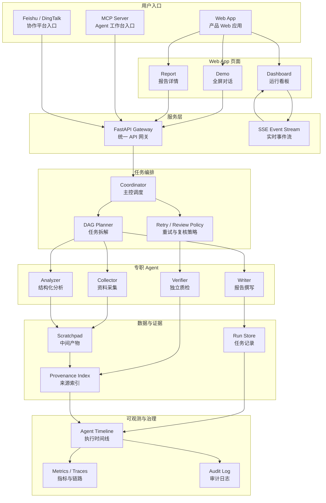

# 竞品分析 Agent 协作系统 — 完整架构设计文档 (V2.0)

**版本**：2.0
**最后更新**：2026-05-13
**设计状态**：完整蓝图（Phase 1 MVP 已实现部分功能，Phase 2/3 规划优化）
**文档用途**：GitHub 仓库设计说明书，展示系统完整性与工程深度

---

## 1. 系统概述

### 1.1 业务目标
解决传统竞品分析流程繁琐重复、信息源分散、依赖个人经验的痛点。构建一个由多专职 Agent 协作的自动化系统，完成从公开信息采集到结构化竞品报告的全链路工作，并确保**每条结论可溯源、每个决策可观测**。

### 1.2 核心能力矩阵

| 能力 | 说明 | 课题对应 |
|------|------|----------|
| **多角色协作** | 采集、分析、撰写、质检四个专职 Agent 协同 | 模拟真实调研小组 |
| **任务编排** | 基于主控循环 + 工具化 Agent，支持动态 DAG | DAG 式任务流转 |
| **交叉审查闭环** | 独立质检 Agent + 规则引擎，防确认偏误 | 交叉审查反馈闭环 |
| **结果溯源** | 工具层强制约束，每条结论附来源 URL + 原文片段 | 有据可查 |
| **可观测性** | 三层模型：产品事件 + OTel 指标 + 会话语义追踪 | 决策过程透明 |
| **韧性设计** | 重试/降级/人工兜底，部分可用策略 | 系统稳定性 |

---

## 2. 设计哲学：借鉴 Claude Code 源码思想

本系统深度借鉴 Claude Code（51.2 万行 TypeScript 工程）的多项核心设计原则，并非简单使用 Agent 框架，而是将工业级工程思想注入竞品分析场景。

| Claude Code 思想 | 本系统落地位置 | 实现阶段 |
|----------------|---------------|----------|
| **主循环 + 工具调用**（单线程主循环，Agent 通过工具完成工作） | Coordinator 主循环，采集/分析/撰写/质检封装为工具 | Phase 2 |
| **Scratchpad 共享目录**（跨 Agent 数据旁路传递，避免上下文爆炸） | 文件系统 Scratchpad，采集结果 JSON 供分析直接读取 | Phase 2 |
| **独立 Verification Agent**（全新进程，不继承历史，防确认偏误） | 质检 Agent 使用不同模型实例，仅接收报告+证据 | Phase 1 已实现 |
| **工具层强制溯源**（工具 API 要求返回 sources，否则报错） | Phase 1 先通过 Prompt + 规则层 provenance guard 约束输出；Phase 2 升级为工具 API 层强制校验与自动重试 | Phase 1 雏形 / Phase 2 强化 |
| **可观测性分层**（产品事件 + OTel 指标 + 会话语义追踪） | 三层模型：业务事件 / 技术指标 / 决策链路 | Phase 2 |
| **流式 Generator 透出**（实时输出内部活动，支持中断） | Phase 1.5 先用 FastAPI SSE 包装 `progress_callback`，Phase 2 升级 `async generator` | Phase 1.5 / Phase 2 |
| **Coordinator 委派原则**（主控不直接执行，只分解任务和调度） | 设计上强调委派优先，实现上允许 Coordinator 调用部分工具 | 设计文档约束 |

---

## 3. 系统架构图（V2.0）



---

## 4. 核心数据模型

### 4.1 竞品知识 Schema（用户输入）

```json
{
  "productName": "产品名称",
  "competitors": ["竞品A", "竞品B"],
  "dimensions": [
    {"name": "定价", "indicators": ["免费版", "付费版", "API 价格"]},
    {"name": "功能", "indicators": ["协作", "集成"]}
  ],
  "analysisType": "SWOT"
}
```

### 4.2 Provenance（溯源对象）— 完整版

```python
from typing import List, Optional
import uuid
from enum import Enum

class ConfidenceLevel(str, Enum):
    HIGH = "high"       # 0.9～1.0  直接源, 高信度
    MEDIUM = "medium"   # 0.6～0.89 二次源, 部分推理
    LOW = "low"         # 0.0～0.59 弱证据, 需人工复核

class SourceRef(BaseModel):
    uri: str                    # 文件路径或 URL
    snippet: str                # 关键原文片段
    start_line: Optional[int] = None
    end_line: Optional[int] = None
    fetch_time: str             # ISO 时间戳

class Provenance(BaseModel):
    conclusion_id: str = str(uuid.uuid4())
    text: str
    source_references: List[SourceRef] = []
    confidence: ConfidenceLevel = ConfidenceLevel.MEDIUM
    generated_by: str           # "collector" | "analyzer" | "writer" | "verifier"
    parent_trace_id: str        # 会话语义追踪 ID
```

### 4.3 任务状态文件（DAG 节点持久化）

```json
{
  "task_id": "collect_price_A",
  "type": "collect",
  "status": "succeeded",
  "input": {"competitor": "产品A", "dimension": "定价"},
  "output_ref": "scratchpad/raw/collect_price_A.json",
  "depends_on": [],
  "blocked_by": [],
  "retry_count": 0,
  "error": null,
  "created_at": "2026-05-13T10:00:00Z"
}
```

### 4.4 会话语义追踪（SemanticStep）

```json
{
  "step_id": "step_001",
  "session_trace_id": "sess_abc123",
  "parent_step_id": null,
  "agent_type": "coordinator",
  "action": "decide_next_task",
  "input_summary": "用户需求: 分析产品A vs 产品B 定价",
  "output": "生成任务: collect_price_A, collect_price_B",
  "evidence_links": ["scratchpad/provenance/sess_abc123/step_001_prov.json"],
  "timestamp": "2026-05-13T10:00:01Z"
}
```

### 4.5 在线产品运行数据模型（Phase 1.5）

Phase 1.5 的目标不是提前做重型企业系统，而是把当前可运行链路包装成可分享、可观测、可持续演进的在线产品。数据模型以“够用、可迁移”为原则，优先 SQLite 或本地 JSON 文件；进入 Phase 3 后再升级 PostgreSQL / Redis / 对象存储。

```text
analysis_runs
- run_id
- product_name
- competitors
- dimensions
- analysis_type
- status              # queued | running | passed | needs_review | failed
- created_at
- completed_at

agent_events
- event_id
- run_id
- type                # agent.start | agent.progress | agent.done | verifier.issue | artifact.ready
- agent               # Collector | Analyzer | Writer | Verifier | Coordinator
- stage
- message
- payload_json
- created_at

artifacts
- artifact_id
- run_id
- kind                # report_markdown | verifier_json | brief_json | provenance_index
- uri_or_path
- content_preview
- created_at

source_references
- source_id
- run_id
- conclusion_id
- uri
- snippet
- confidence
- retrieved_at
```

**短期取舍**
- 产品 Demo：SQLite / JSON 足够，部署简单，能支撑页面刷新后继续查看任务与报告。
- 正式云部署：PostgreSQL 存 run/event/artifact 元数据，Redis 支撑任务队列和实时状态缓存，对象存储保存大报告、截图和原始证据。

---

## 5. 优化点详细设计

本章逐个阐述 12 项核心优化的设计原理、工程实现及在 Phase 1/2/3 的落地计划。

### 优化 1：主 Agent 循环 + 工具化专职 Agent

**原理**
不预设静态 DAG，而是由一个主循环（Coordinator）动态调用工具化的专职 Agent。每个专职 Agent 被封装为一个 **Tool**（如 `collect_tool`, `analyze_tool`），由 Coordinator 根据上下文决定调用顺序和策略。

**工程实现**
```python
# 伪代码
tools = [CollectTool(), AnalyzeTool(), ComposeTool(), VerifyTool()]
while True:
    response = llm.invoke(messages, tools=tools)
    if not response.tool_calls:
        break
    for tool_call in response.tool_calls:
        result = execute_tool(tool_call)
        messages.append({"role": "tool", "content": result})
```

**Phase 落地**
- Phase 1：使用 CrewAI 顺序执行（简化版，替代静态 DAG）
- Phase 2：重写为自研主循环 + 工具化 Agent，支持动态决策
- Phase 3：支持并行工具调用 + 子 Agent 派生

---

### 优化 2：独立 Verification Agent（不继承历史）

**原理**
质检 Agent 必须是一个 **全新进程/调用**，不继承撰写 Agent 的任何对话历史。只接收三部分：原始需求、报告草稿、所有溯源记录。系统提示强调"主动找问题，而非确认正确性"。

**工程实现**
- 使用不同模型实例（MiMo-V2.5-Pro）
- 在调用前清空 messages，只注入专门的质检 prompt
- 输出结构包含 `passed`, `confidence`, `issues` 数组

**Phase 落地**
- Phase 1：已实现（Verifier Agent 独立，不同模型）
- Phase 2：增加历史对比功能，检测报告版本间差异

---

### 优化 3：质检双层结构（规则引擎 + 模型辅助）

**原理**
第一层：确定性规则（必填字段、来源 URL 格式、章节完整性），用代码实现，速度快、无幻觉。
第二层：大模型进行语义校验（逻辑矛盾、数据不一致、幻觉检测），输出置信度。

**工程实现**
```python
def verify_report(report, context):
    # 规则层
    if not has_required_sections(report):
        return {"passed": False, "reason": "missing_sections"}
    if not all_conclusions_have_provenance(report):
        return {"passed": False, "reason": "missing_provenance"}
    # 模型层
    model_verdict = llm_check(report, context)
    return model_verdict
```

**Phase 落地**
- Phase 1：仅模型层（简化）
- Phase 2：增加规则引擎，两层并行
- Phase 3：支持用户自定义规则（DSL）

---

### 优化 4：可观测性三层模型

**原理**
- **L1 产品事件层**：记录用户操作（分析开始、报告导出、人工干预），用于业务分析。
- **L2 OTel 指标层**：标准 OpenTelemetry 指标（延迟、Token 消耗、调用次数）、链路追踪、结构化日志。
- **L3 会话语义追踪层**：记录每个 Agent 的决策步骤（SemanticStep），形成完整推理链，支持 UI 下钻。

**工程实现**
- L1：结构化 JSON 写入本地文件或 ClickHouse
- L2：集成 OpenTelemetry SDK，暴露 metrics/traces
- L3：每个 Agent 调用前后生成 SemanticStep 对象，存入内存/文件，关联 `session_trace_id`

**Phase 落地**
- Phase 1：控制台日志 + 基础 provenance（L3 雏形）
- Phase 2：集成 OpenTelemetry + 产品事件记录
- Phase 3：可视化 Dashboard（Grafana + 自定义 UI）

---

### 优化 5：智能重试与人工兜底

**原理**
根据质检 Agent 输出的问题类型，触发不同修正策略：
- 缺失证据 → 调用采集工具补充特定字段
- 逻辑矛盾 → 调用分析工具重新分析，附带矛盾证据
- 多次失败后转入人工队列（邮件 / 看板）

**工程实现**
```python
if verification.passed:
    return report
else:
    for issue in verification.issues:
        if issue.type == "missing_evidence":
            retry_collect(issue.field)
        elif issue.type == "logical_conflict":
            retry_analyze(issue.context)
    retry_count += 1
    if retry_count >= MAX_RETRY:
        send_to_human_queue(report, verification)
```

**Phase 落地**
- Phase 1：最多 1 次重试，无人工队列
- Phase 2：支持 3 次重试 + 人工兜底（简单邮件通知）
- Phase 3：集成工单系统 / Slack 通知

---

### 优化 6：Scratchpad 共享目录

**原理**
采集 Agent 将原始数据写入文件系统的共享目录（如 `scratchpad/raw/`），分析 Agent 直接从该目录读取，避免通过主控 Agent 传递大量数据，防止上下文爆炸。

**工程实现**
- 目录结构（见架构图）
- 每个写入文件返回 URI（如 `file://scratchpad/raw/collect_001.json`）
- 分析 Agent 通过 Read 工具读取文件内容

**Phase 落地**
- Phase 1：内存 dict 替代（简化）
- Phase 2：实现文件系统 Scratchpad + URI 引用
- Phase 3：支持对象存储（MinIO/S3）

---

### 优化 7：工具层强制溯源约束

**原理**
在工具 API 层面要求模型输出必须包含 `source_references` 字段。如果模型未提供，工具返回错误（BlockingError），逼迫模型重试或补充。

**工程实现**
```python
def collect_tool(url: str) -> dict:
    content = fetch(url)
    # 强制要求模型在响应中包含 sources
    response = llm.invoke("请提取信息并附上来源", tools=...)
    if "source_references" not in response or not response["source_references"]:
        raise BlockingError("Missing source_references. Please include provenance.")
    return response
```

**Phase 落地**
- Phase 1：Prompt 层面强制要求 + runner 规则层 provenance guard，未加溯源则质检判为不通过
- Phase 2：工具 API 层面强制校验 + 自动重试
- Phase 3：增加区块链式不可变溯源存证（可选）

---

### 优化 8：Generator 流式透出

**原理**
使用 Python `async generator` 逐步 yield Agent 的内部活动（任务开始/结束、中间输出、日志），前端通过 SSE 实时接收并展示，用户可在早期发现方向错误时中断。

**工程实现**
```python
async def run_analysis_stream(user_input):
    yield {"type": "status", "message": "启动协调器..."}
    async for step in coordinator.run(user_input):
        yield step
        if step["type"] == "task_error" and user_wants_abort():
            break
```

**Phase 落地**
- Phase 1：控制台实时打印（`print` 代替 `yield`）
- Phase 1.5：在现有 `runner.py progress_callback` 基础上封装 FastAPI SSE，先推送 `agent.start / agent.progress / agent.done / verifier.issue / artifact.ready` 事件，支撑 Web App 的 Demo / Dashboard / Report 页面实时联动
- Phase 2：实现真正的 `async generator` + Coordinator 事件流
- Phase 3：支持 WebSocket 双向通信

### 优化 8.1：Web App 页面与实时 Dashboard

**原理**
Streamlit 适合快速证明链路，但复杂产品体验会遇到布局、路由、实时交互和顶部框架限制。Phase 1.5 将当前能力升级为独立 Web App，并通过后端 API 与真实 Agent 链路交互：

```text
React / Vite Frontend
├── /              产品介绍页
├── /demo          全屏对话式任务发起
├── /dashboard     Agent 协作过程可视化
└── /reports/:id   完整报告、Verifier JSON、Provenance 索引

FastAPI Backend
├── POST /api/runs
├── GET  /api/runs/{run_id}
├── GET  /sse/runs/{run_id}
└── GET  /api/artifacts/{artifact_id}
```

**工程实现**
- `/demo` 负责输入目标产品、竞品、维度和重点指标，提交后拿到 `run_id`
- `/dashboard` 订阅同一个 `run_id` 的 SSE，渲染 Agent 时间线、状态卡片、事件日志、产物链接
- `/reports/:id` 展示完整 Markdown 报告、Verifier JSON、输入 Brief 和来源索引
- 当前 CrewAI 顺序链路不重写，只通过 API 层包装，保证产品体验升级不阻塞核心算法演进

**Phase 落地**
- Phase 1.5：React + FastAPI + SSE + SQLite/JSON，形成可持续迭代的在线 Web App
- Phase 2：Dashboard 对接 DAG 节点、Scratchpad 文件、Run Inspector 下钻视图
- Phase 3：接入权限、团队空间、长期记忆、完整审计日志

### 优化 8.2：MCP 与协作平台接入

**原理**
系统最终不只作为一个网页应用存在，还应作为企业知识工作流中的可调用能力。通过 MCP Server 暴露竞品分析工具，使 Claude Code、Codex 等 Agent 工作台可以直接发起分析、查询报告、读取 provenance；通过飞书、钉钉等协作平台接入，把分析结果送入企业日常工作流。

**MCP 工具形态**
```text
compeye.create_run(input)          # 创建竞品分析任务
compeye.get_run(run_id)            # 查询任务状态
compeye.stream_events(run_id)      # 订阅 Agent 执行事件
compeye.get_report(run_id)         # 获取 Markdown 报告
compeye.get_sources(run_id)        # 获取 provenance / source references
```

**协作平台形态**
- 飞书：机器人命令发起分析、报告推送到飞书文档、质检失败进入群通知或审批流程
- 钉钉：机器人交互、报告卡片、任务状态通知、人工复核入口
- Webhook：向企业内部系统推送 `artifact.ready`、`verifier.issue`、`run.failed` 等事件

**Phase 落地**
- Phase 2：先定义 MCP 工具协议和后端 API 对齐，保证 Web App、CLI、MCP 复用同一套 run/event/artifact 模型
- Phase 3：提供正式 MCP Server、飞书/钉钉机器人、Webhook 与企业权限接入

---

### 优化 9：Coordinator 委派原则（拥有工具但原则委派）

**原理**
设计文档中明确：Coordinator 原则上不直接执行具体任务，而是将工作委派给专职 Agent（工具）。但为了方便实现，Coordinator 可以保留调用部分工具的能力（如读 Scratchpad），在设计上强调"委派优先"。

**工程实现**
- 代码注释：`# Coordinator 原则上只调度，不执行具体分析`
- 工具调用规则：只有 `collect/analyze/compose/verify` 四类核心工具由 Agent 执行，Coordinator 可用辅助工具（如 `read_scratchpad`）

**Phase 落地**
- Phase 1：CrewAI 无明确 Coordinator
- Phase 2：自研 Coordinator 时遵守此原则
- Phase 3：使用权限系统强制执行（见优化 12）

---

### 优化 10：Plan Mode 可选开关

**原理**
在生成最终报告前，强制系统先输出一个"分析大纲 + 数据论点映射表"，经用户（或高级质检 Agent）审批后再进入撰写阶段，避免方向性错误导致返工。

**工程实现**
```python
if plan_mode_enabled:
    plan = coordinator.create_plan(user_input)
    if user_approves(plan):
        execute_plan(plan)
    else:
        user_modify_plan()
```

**Phase 落地**
- Phase 1：未实现
- Phase 2：作为可选特性，通过环境变量启用
- Phase 3：集成到 UI 中（开关 + 可视化计划编辑）

---

### 优化 11：持久化记忆（短期任务记忆 + 长期企业知识库）

**原理**
- **短期记忆**：当前分析会话的任务状态、中间结论、已采集 URL，用于断点恢复（会话恢复）。
- **长期记忆**：历史分析报告、已验证的事实（价格、功能）、用户偏好，存入向量库 + 图数据库，供后续分析参考。

**工程实现**
- 短期：SQLite / Redis，按 `session_id` 存储状态
- 长期：ChromaDB（向量） + NetworkX（图），定期从 Scratchpad 提取更新

**Phase 落地**
- Phase 1：无持久化
- Phase 1.5：SQLite / JSON 保存 `analysis_runs`、`agent_events`、`artifacts`、`source_references`，保证刷新页面后仍能查看 Dashboard 与报告
- Phase 2：短期记忆（文件存储任务状态）与 Scratchpad URI 打通
- Phase 3：长期记忆 + 相关性检索

---

### 优化 12：权限表设计（简化布尔标志）

**原理**
为每个 Agent 分配最小权限：哪些工具可调用、哪些目录可读写。简化版用布尔标志（如 `read_only`, `allow_network`）。

**工程实现**
```python
class AgentPermissions(BaseModel):
    read_only: bool = False          # 只能读 Scratchpad
    allow_network: bool = False      # 可发起 HTTP 请求
    allow_write_final_report: bool = False  # 可写入最终报告

permissions = {
    "collector": AgentPermissions(read_only=False, allow_network=True),
    "analyzer": AgentPermissions(read_only=True, allow_network=False),
    "writer": AgentPermissions(read_only=False, allow_network=False, allow_write_final_report=True),
    "verifier": AgentPermissions(read_only=True, allow_network=False),
}
```

**Phase 落地**
- Phase 1：无显式权限控制
- Phase 2：在工具调用前检查权限，抛出异常
- Phase 3：集成更细粒度的 RBAC

---

## 6. 分阶段实施路线图

| 阶段 | 时间 | 范围 | 已包含优化 |
|------|------|------|------------|
| **Phase 1 (MVP)** | 已完成 | 四 Agent 顺序链路，CLI + Streamlit，控制台可观测，基础 provenance | 优化2（独立 Verifier 雏形）、优化3（模型层质检）、优化5（简化重试） |
| **Phase 1.5 (Product Demo)** | 当前优先 | 保留真实 CrewAI 链路，新增 FastAPI API 层、SSE 事件流、Web App（Demo / Dashboard / Report）、SQLite/JSON run store、云端可访问部署 | 优化8、8.1、11 的轻量落地 |
| **Phase 2 (增强)** | 1-2 个月 | 自研 Coordinator 主循环，Scratchpad 文件系统，DAG 节点，工具层强制溯源，Run Inspector，短期任务记忆 | 优化1、6、7、8、9、10、12 部分 |
| **Phase 3 (平台化集成)** | 3-6 个月 | PostgreSQL/Redis、长期记忆库，语义 Diff，韧性设计（熔断/降级/人工兜底），权限系统，完整 OTel，企业级 Dashboard，MCP Server，飞书/钉钉机器人 | 优化4（完整）、优化5（人工兜底）、优化8.2、优化11 |

---

## 7. 技术选型与部署

| 组件 | Phase 1 选型 | Phase 2/3 升级方向 |
|------|-------------|-------------------|
| 多 Agent 框架 | CrewAI | 自研主循环 + 工具化 |
| 模型 API | MiMo-V2.5 / Pro | 支持多模型 fallback |
| 前端 | Streamlit | React/Vite Web App（Demo / Dashboard / Report） |
| API 服务 | CLI / Streamlit 内嵌调用 | FastAPI REST + SSE |
| 存储 | 内存 dict | SQLite/JSON run store → 文件系统 Scratchpad → MinIO |
| 状态管理 | 无 | SQLite → Redis |
| 可观测性 | 控制台日志 | Dashboard 事件流 → OpenTelemetry + ClickHouse + Grafana |
| 流式传输 | 无 | SSE → WebSocket |
| 记忆库 | 无 | ChromaDB + NetworkX |
| 外部集成 | 无 | MCP Server、飞书/钉钉机器人、Webhook |

**部署建议**
- Phase 1.5 在线部署：FastAPI + React 静态资源同服务部署，SQLite/JSON 本地持久化；可选 Render / Railway / Fly.io / 云服务器
- 开发测试：Docker Compose（Python + Redis + MinIO）
- 生产环境：K8s + PostgreSQL / Redis / 对象存储 + Prometheus stack

---

## 8. 总结

本设计文档（V2.0）为竞品分析 Agent 协作系统提供了完整的架构蓝图，涵盖从基础链路到企业级优化的全貌。通过借鉴 Claude Code 的核心工程思想，系统不仅实现了自动化分析闭环，更在**可观测性、溯源强制性、韧性设计**上达到了工业级标准。Phase 1 MVP 已跑通并开源，后续阶段将按路线图逐步实现各项高级优化。
